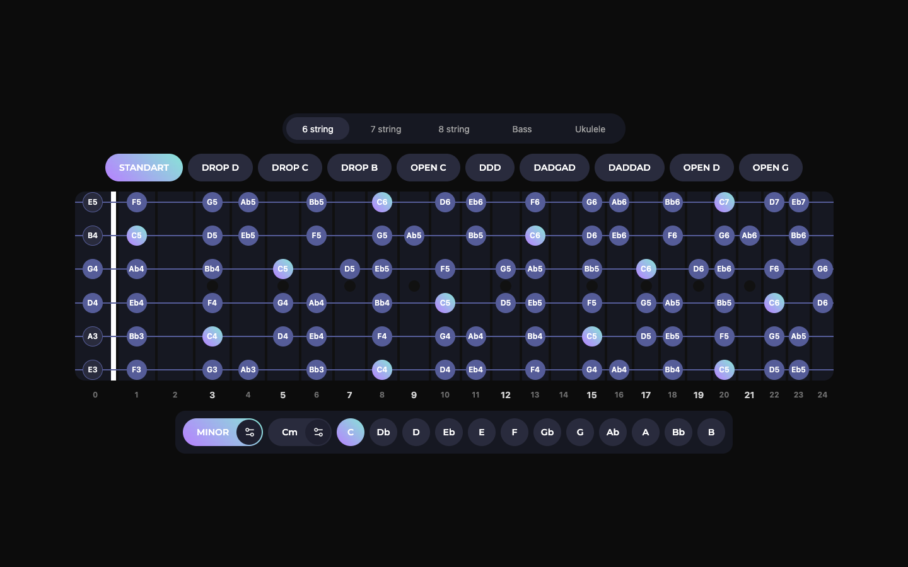

# ProScale


**Интерактивный помощник для изучения гамм и аккордов на грифе.**

Смотреть тут: https://mike-novum.github.io/proscale-web/

Визуализация нот на грифе гитары (6/7/8 струн), баса и укулеле с поддержкой разных строёв, тональностей и звуковым воспроизведением выбранной гаммы или аккорда.



## Возможности

- Поддержка нескольких инструментов: 6-ти, 7-ми, 8-струнная гитара, бас, укулеле
- Альтернативные строи: Standard, Drop D/C/B, Open C/D/G, DADGAD, DDD и другие
- Просмотр гамм и аккордов на грифе
- Воспроизведение выбранной гаммы или аккорда через (на iOS воспроизведение не поддерживается)

## 🚀 Запуск проекта

> Требования: **Node.js 18+** и **npm**.

```bash
# Установить зависимости
npm install

# Запустить dev-сервер
npm run dev

# Сборка продакшен-версии
npm run build

# Локально посмотреть собранную версию
npm run preview
```

### Скрипты

| Команда | Что делает |
|---------|------------|
| `npm run dev` | Запускает Astro dev-сервер с hot reload |
| `npm run build` | Собирает статический сайт в `./dist` |
| `npm run preview` | Локальный просмотр собранного билда |
| `npm run lint` | Прогоняет ESLint по `src` |
| `npm run lint:fix` | ESLint с авто-исправлениями |
| `npm test` | Запускает Jest |
